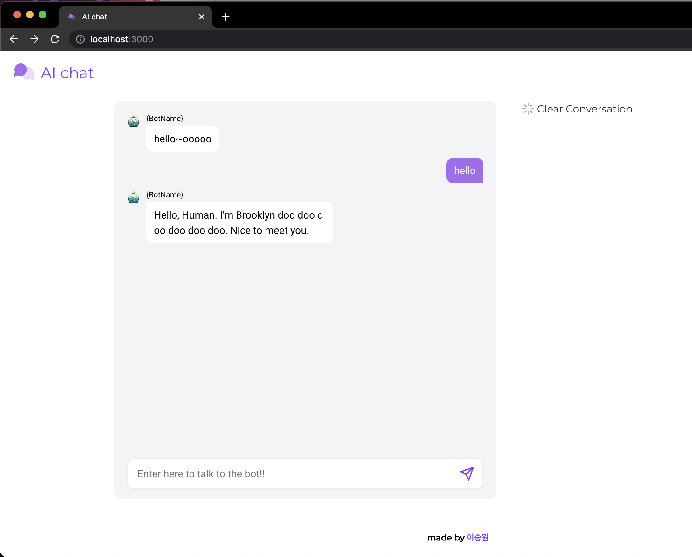

# AI chat

## For internship

이번 국민대학교에서 실시한 동계 인턴에 참여했고, 그 중 커먼 컴퓨터에서 실시한 과제에 대한 결과물이다.

## How to run

- git clone https://github.com/KMUlee/AI-Chat.git
- npm install
- 프로젝트의 루트안에 .env 파일 생성
- .env 파일 안에 REACT_APP_API = "!!!!!!!!! API 주소 !!!!!!!!!!" 작성
- npm start

## Requirements

- React를 사용해서 구현하라
- 디자인에 나와있는 내용대로 스타일링을 작업해라
- 서버여 연결하여 채팅을 보내면 API를 호출하여 Response를 받아올 수 있게 구현하라
- 받아온 Response를 채팅창에 나타날 수 있게 구현하라
- Clear Conversation 버튼을 누루면 Modal창을 띄워라
- 채팅창 초기화 기능을 구현하라
- 이외에 UI, UX 적으로 추가로 개선 가능하며, 추가 작업한 부분과 그에 대한 추가 이유 및 어떤식으로 개선하였는지 기술하라

## Implementation

### Chatting

- 로봇이 먼저 말을 걸었다는 것을 표현하기 위해 기본 메시지는 hello~ooooo로 고정했으며 이는 초기화시에도 바뀌지 않음
- 원할한 가독성을 위하여 모든 메시지의 최대 너비를 고정했으며, overflow 시 다음 줄로 넘어가도록 함
- 기본 채팅창 처럼 메시지가 채팅창 영역을 벗어나는 경우 스크롤 가능하도록 함
- 채팅 메시지가 계속 쌓이면 그에 맞춰서 스크롤 하는 게 불편하다, 따라서 채팅 시 마지막 메시지로 스크롤이 이동하도록 만듦
- 채팅 하는 곳인지 식별할 수 있도록 placeholder에 적절한 메시지를 넣음
- 채팅을 하나 보내면 그 채팅에 대한 AI 대답이 느리게 도착하며, 그 와중에 메시지를 추가로 입력하는 경우 처리하는 과정에서 버그가 발생 -> 메시지를 하나 보냈으면 다음 대답까지 메시지 작성기능을 막아놓음
- 메시지로 빈 문자열을 보내는 경우는 쓸모 없는 메시지라고 생각하여 trim()을 사용하여 빈 문자열인지 판단 후, 빈 문자열이면 submit기능을 실행하지 않음

### Modal

- Clear Conversation 버튼 클릭시 모달창이 띄워지며, 모달창에 대한 집중을 위하여 overlay를 만들어 모달창 주변 영역은 어둡게 만듦
- 모달창 주변 영역(overlay) 클릭 시 모달창을 닫음
- 모달창 활성화시 모달의 뒷 화면은 고정되어야 하므로, 모달창 활성화시 스크롤 기능을 막음

### Profile

맨 밑에 footer를 넣었으며 이름 클릭시 모달창이 띄워지며 간단한 자기소개와 깃허브로 갈 수 있는 버튼을 만들었음

## 사용한 기술

- ReactJS (with styled components)

## 실행시 이미지

